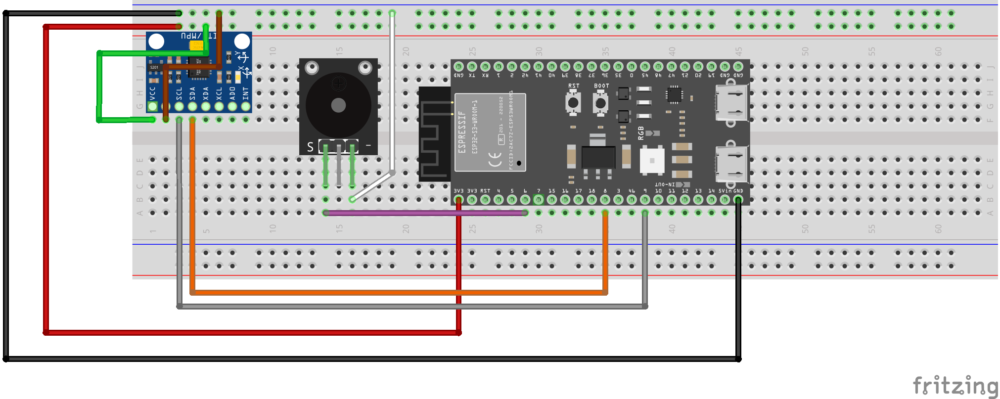
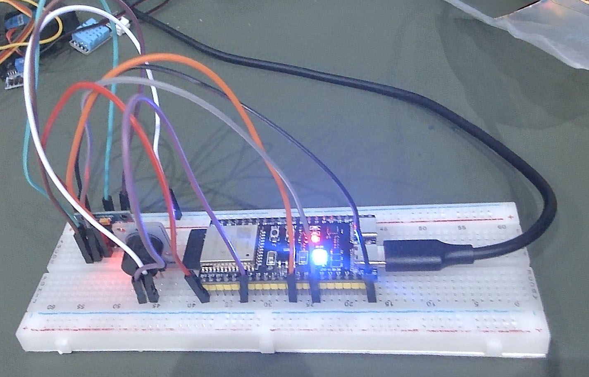

# Fall Detection & Alert System

An ESP32-S3 wearable/room device that classifies body state (standing, sitting, walking, dizzy, fall) from MPU6050 motion data using an on-device TinyML model, gives silent per-state Neopixel feedback, sounds a buzzer for concerning states, and sends a Telegram alert to an emergency contact when a fall is confirmed.

**Status:** Phase 4 — TinyML Data Collection & Training

> This README is being filled in phase by phase as the project is built — see `CLAUDE.md` and `docs/TASKS.md`. Sections below will fill in as each phase completes.

**Repo:** [github.com/msohdy/fall-detection-physical-ai-esp32](https://github.com/msohdy/fall-detection-physical-ai-esp32) · **Project board:** [Fall Detection Build Roadmap](https://github.com/users/msohdy/projects/3)

## Overview

*(Problem, goals, and non-goals — filled in from `docs/Fall_Detection_PRD.md`.)*

## Bill of Materials

*(Filled in during Phase 1/3 — components and where to get them.)*

## Wiring

**Diagram tool:** [Fritzing](https://fritzing.org/) (free, open source, breadboard-style diagrams; switched from an initial Wokwi plan once actually building the diagram).

Fritzing project source: [`docs/wiring/fall-detection-wiring.fzz`](docs/wiring/fall-detection-wiring.fzz)

**Actual build:**

**Pin table:**

| Signal | MPU6050 | Neopixel (onboard) | Buzzer (active) |
| --- | --- | --- | --- |
| Power | VCC → 3.3V | onboard, no wiring | + → **GPIO6** (switched power) |
| Ground | GND → GND | onboard | - → GND |
| Data/Signal | SDA → GPIO8 | GPIO48 (onboard) | *(none — see note below)* |
| Clock | SCL → GPIO9 | — | — |

The Neopixel is the board's onboard single WS2812 RGB LED, not an external strip. The buzzer is confirmed **active** with no dedicated signal pin at all — its 3rd pin is unused, and it's controlled by switching power to it directly via GPIO6 (`digitalWrite(HIGH/LOW)`), not `tone()`. See [Build Log / Decisions](#build-log--decisions) for how this was determined.

**Form factor (v1):** breadboard prototype, powered by a USB powerbank — handheld, not worn or room-mounted. No enclosure/form-factor commitment yet; strain relief and wearable-specific concerns are out of scope until a final form factor is chosen.

*(Wiring diagram export and breadboard photos to be added here once produced.)*

## Setup

**Firmware toolchain:** [PlatformIO](https://platformio.org/) as a VS Code extension.

- Board: `esp32s3usbotg` in `platformio.ini` (PlatformIO's board ID for Espressif's official ESP32-S3-USB-OTG devkit). The actual hardware is a generic ESP32-S3-N16R8 dev board (confirmed via `esptool flash_id`: ESP32-S3, 16MB quad-I/O flash, 8MB quad PSRAM) — see [Build Log / Decisions](#build-log--decisions).
- Framework: `arduino`
- Confirmed: project builds and uploads over USB (native USB port, shows up as `VID:PID=303A:1001`).

## Data Collection Tooling

**[`tools/serial-data-logger.html`](tools/serial-data-logger.html)** — a self-contained Web Serial page (Chrome/Edge only) for capturing MPU6050 samples to CSV. Built after two Edge Impulse ingestion paths turned out to be dead ends on this setup:

1. `edge-impulse-cli` (for the classic Data Forwarder) failed to install — one dependency needs native compilation via Visual Studio Build Tools, which aren't installed.
2. Edge Impulse Studio's browser-based "Connect a new device" WebSerial flow requires the device firmware to speak Edge Impulse's AT-command protocol — a different thing entirely from plain CSV serial output, and not worth implementing just for data collection.

Instead: connect to the board, log incoming CSV lines to an editable table (delete bad rows individually or in bulk), and export a clean CSV per recording session. Those files get imported into Edge Impulse via Studio's **Data acquisition → Upload data** CSV wizard.

## Training the Model

*(Filled in during Phase 4 — dataset, class list, and how to reproduce training.)*

## Building & Flashing

*(Filled in during Phase 6.)*

## Testing & Validation

*(Filled in during Phase 7 — results against the PRD's success criteria.)*

## Known Limitations

*(Filled in during Phase 8 — be specific and honest here.)*

## Build Log / Decisions

*(A running record of meaningful choices and deviations from the original plan, added as they happen — see `CLAUDE.md`.)*

- **License:** MIT, chosen over Apache-2.0 for simplicity (no patent-grant needs expected for a hobbyist hardware project).
- **PlatformIO board ID:** `platformio.ini` uses `board = esp32s3usbotg`, which is PlatformIO's ID for Espressif's *official* ESP32-S3-USB-OTG devkit (LCD + 4 physical buttons). The actual hardware is a generic ESP32-S3-N16R8 dev board with none of that — confirmed by asking the chip directly via `esptool flash_id`: ESP32-S3, 16MB quad-I/O flash, 8MB quad PSRAM. This board ID was kept intentionally despite the mismatch; it builds and uploads fine, but its pin macros won't match this hardware, so **Phase 3 wiring will need pins set explicitly in `include/pins.h` rather than relying on board-default pin names**.
- **Serial-over-USB gotcha:** this board has one native USB port (no separate CH340/CP2102 UART bridge), enumerating as `VID:PID=303A:1001`. Arduino's `Serial` doesn't route through that port by default — without `-DARDUINO_USB_CDC_ON_BOOT=1` in `build_flags`, `Serial.print()` silently goes to unused physical UART0 pins instead. This flag is now set in `platformio.ini` (added once `main.cpp` needed serial output for I2C bring-up testing).
- **GitHub Issues/Projects granularity:** one GitHub Issue was created per phase (not per individual task) and attached to a matching milestone, so the [Project board](https://github.com/users/msohdy/projects/3) stays readable. `docs/TASKS.md` remains the source of truth for task-level detail — each phase issue links back to its section there.
- **Secrets:** Telegram bot token/chat ID are currently saved locally in a git-ignored `.env` as personal notes. They'll move into a git-ignored `include/secrets.h` (with a `secrets.h.example` template committed) when Telegram integration is coded in Phase 5 — `.env` isn't read by the firmware.
- **Deferred (by choice, not forgotten):** `CODEOWNERS`/PR-review notes and GitHub Discussions — both explicitly pushed to closer to Phase 7/8 when the project has outside contributors.
- **Buzzer confirmed active** by direct test: connecting VCC to 3.3V and GND with the 3rd pin left unwired produced a steady, continuous tone — meaning it has its own internal driver circuit. This corrects an initial guess of "passive" based on an old sample sketch that used `tone()` with varying frequencies; that sketch apparently doesn't match this actual buzzer.
- **Buzzer has no logic-level control pin at all** — its 3rd pin turned out to be unused (it buzzed with just VCC+GND wired). Control instead works by switching **power** to the buzzer: the wire originally planned for a fixed 3.3V rail goes to **GPIO6** instead, which sources power directly; GND stays on GND; the 3rd/mid pin is left disconnected. Confirmed working via `digitalWrite(GPIO6, HIGH/LOW)`. Since an active buzzer also can't vary pitch, the PRD's "distinct tone per state" requirement will need to become distinct on/off beep *patterns* instead (Phase 5). Driving the buzzer directly off a GPIO (no transistor) works for now but may need revisiting if current draw proves too high for the pin.
- **I2C pins set explicitly rather than relying on board defaults**, since `platformio.ini`'s board ID doesn't exactly match the physical hardware (see the board-ID note above) — GPIO8 (SDA) / GPIO9 (SCL), which happen to match the Arduino-ESP32 core's own `Wire.begin()` defaults on ESP32-S3 anyway.

## License

MIT — see [`LICENSE`](LICENSE).
