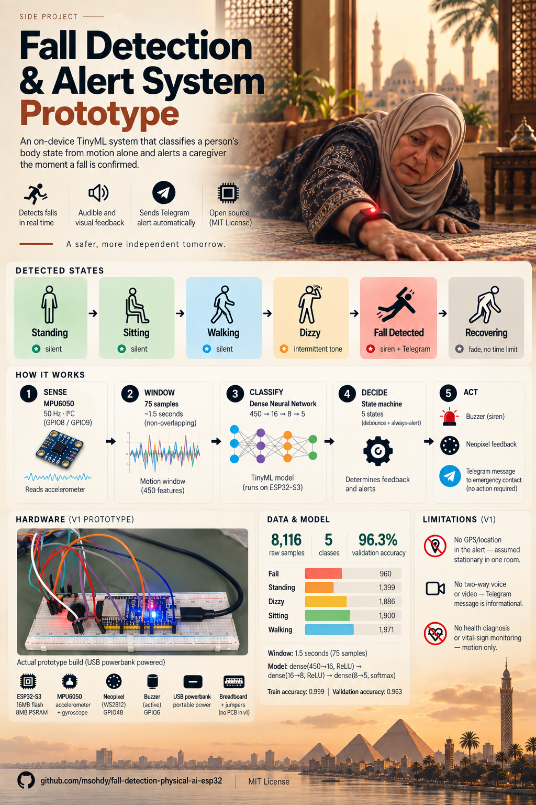
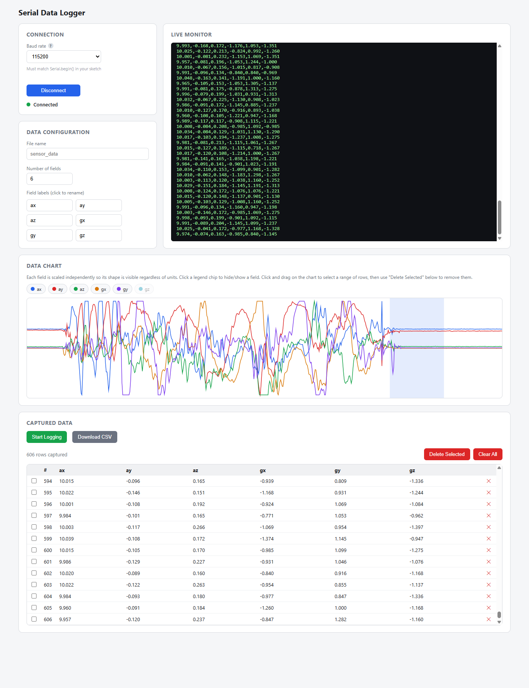
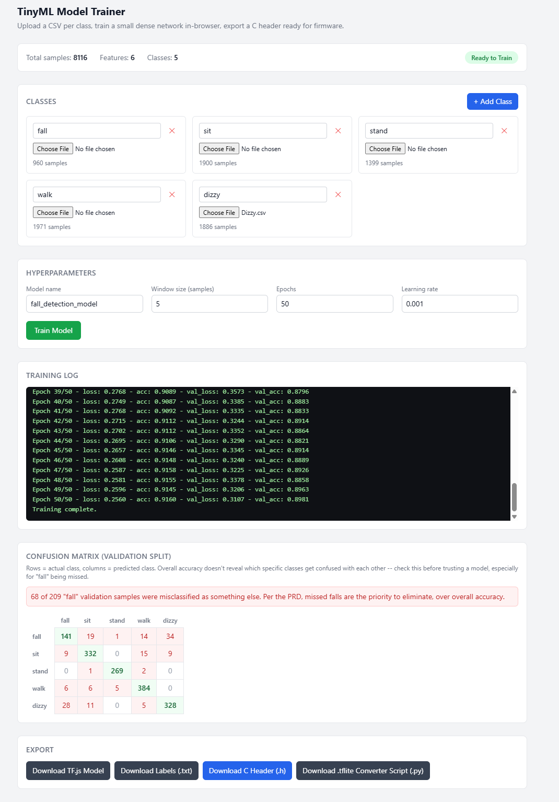

# Fall Detection & Alert System



An ESP32-S3 wearable/room device that classifies body state (standing, sitting, walking, dizzy, fall) from MPU6050 motion data using an on-device TinyML model, gives silent per-state Neopixel feedback, sounds a buzzer for concerning states, and sends a Telegram alert to an emergency contact when a fall is confirmed.

**Status:** Phase 6 complete — Phase 7: Testing & Validation in progress. (Phase 6 closed with one small item carried forward: a clean final untethered/battery confirmation run, folded into Phase 7's checklist.)

> This README is being filled in phase by phase as the project is built — see `CLAUDE.md` and `docs/TASKS.md`. Sections below will fill in as each phase completes.

**Repo:** [github.com/msohdy/fall-detection-physical-ai-esp32](https://github.com/msohdy/fall-detection-physical-ai-esp32) · **Project board:** [Fall Detection Build Roadmap](https://github.com/users/msohdy/projects/3)

## Overview

**Problem.** A person living or working alone has no automatic way to signal a fall. Manual alerting (pressing a button, calling out) fails exactly when someone is unconscious or too disoriented to act.

**Goals**

- Classify body state in real time from IMU data: standing, sitting, walking, dizzy, fall.
- Give silent, glanceable feedback (Neopixel color) for every state, so the device isn't alarming during normal activity.
- Escalate audibly only for concerning states (dizzy, fall) — a caregiver should be able to tell severity apart by sound alone.
- On a confirmed fall, notify a remote emergency contact over Telegram without requiring the fallen person to act.
- Require a sustained, confirmed signal before silencing an alarm, to avoid false-clears from a momentary misread.

**Non-goals (v1)**

- No health diagnosis or vital-sign monitoring — the device infers activity state from motion only.
- No GPS/location in the alert (device is assumed stationary within one home/room).
- No two-way voice or video in the alert — the Telegram message is informational, not a call.

**How the built system differs from the original PRD** (full detail in [Firmware Architecture](#firmware-architecture), [Known Limitations](#known-limitations), and `docs/TASKS.md`):

- No TFLite Micro — inference is a hand-rolled forward pass over a custom-trained dense network (Edge Impulse was dropped entirely; see [Training the Model](#training-the-model)).
- Fall confirmation and alerting is a `FALLEN` → `ALARMED` debounce-then-always-alert design, not the PRD's single-frame trigger — a deliberate product decision made during Phase 6 testing, prioritizing "never suppress a real alert" over "never send an extra one."
- v1 is a handheld breadboard prototype (powered by a USB powerbank), not the wearable or room-mounted form factor the PRD assumed — see [Bill of Materials](#bill-of-materials) and the Wiring section's form-factor note.
- "Zero missed falls" is not yet fully met by the trained model (~11.2% of fall samples still confused with "dizzy") — see [Known Limitations](#known-limitations).

## Bill of Materials

- **ESP32-S3 dev board** — generic ESP32-S3-N16R8 board (16MB flash, 8MB PSRAM). Runs the classifier, state machine, and WiFi/Telegram calls. *Not* the official ESP32-S3-USB-OTG devkit that `platformio.ini`'s board ID technically names — see [Build Log](#build-log--decisions).
- **MPU6050 breakout** — standard I²C accelerometer+gyroscope module. Primary sensor, feeds the windowed IMU data the classifier reads.
- **Neopixel LED** — the board's onboard single WS2812 RGB LED (GPIO48), no external strip used. Silent per-state color feedback.
- **Buzzer** — a 3-pin module that turned out to be **active** with no usable signal pin (see [Wiring](#wiring)), controlled by switching its power via GPIO6. Audible escalation for dizzy/fall states.
- **Power source (v1)** — USB powerbank. Portable power for the handheld breadboard prototype.
- **Breadboard + jumper wires** — standard prototyping breadboard, no PCB in v1.

**Not used in this project** (per the original PRD, reserved for a different/future project): camera, DHT11, IR sensor, ultrasonic sensor, fan/relay, servo motor.

*Specific vendor links aren't included yet — these are generic, widely available parts. Sourcing links can be added here later if useful for reproducing the exact build.*

## Wiring

**Diagram tool:** [Fritzing](https://fritzing.org/) (free, open source, breadboard-style diagrams; switched from an initial Wokwi plan once actually building the diagram).


Fritzing project source: [`docs/wiring/fall-detection-wiring.fzz`](docs/wiring/fall-detection-wiring.fzz)

**Actual build:**


**Pin table:**

| Signal | MPU6050 | Neopixel (onboard) | Buzzer (active) |
| --- | --- | --- | --- |
| Power | VCC → 3.3V | onboard, no wiring | + → **GPIO6** (switched power) |
| Ground | GND → GND | onboard | - → GND |
| Data/Signal | SDA → GPIO8 | GPIO48 (onboard) | *(none — see note below)* |
| Clock | SCL → GPIO9 | — | — |

The Neopixel is the board's onboard single WS2812 RGB LED, not an external strip. The buzzer is confirmed **active** with no dedicated signal pin at all — its 3rd pin is unused, and it's controlled by switching power to it directly via GPIO6 (`digitalWrite(HIGH/LOW)`), not `tone()`. See [Build Log / Decisions](#build-log--decisions) for how this was determined.

**Form factor (v1):** breadboard prototype, powered by a USB powerbank — handheld, not worn or room-mounted. No enclosure/form-factor commitment yet; strain relief and wearable-specific concerns are out of scope until a final form factor is chosen.

## Setup

**Firmware toolchain:** [PlatformIO](https://platformio.org/) as a VS Code extension.

- Board: `esp32s3usbotg` in `platformio.ini` (PlatformIO's board ID for Espressif's official ESP32-S3-USB-OTG devkit). The actual hardware is a generic ESP32-S3-N16R8 dev board (confirmed via `esptool flash_id`: ESP32-S3, 16MB quad-I/O flash, 8MB quad PSRAM) — see [Build Log / Decisions](#build-log--decisions).
- Framework: `arduino`
- Confirmed: project builds and uploads over USB (native USB port, shows up as `VID:PID=303A:1001`).

**Before building, set up your own credentials** (the repo never contains real ones):

1. Copy [`include/secrets.h.example`](include/secrets.h.example) to `include/secrets.h` (git-ignored — never commit this file).
2. Fill in `WIFI_SSID` / `WIFI_PASSWORD` for the network the device should join. Note: the ESP32-S3 is **2.4GHz WiFi only** — if using a phone hotspot, make sure it's not set to 5GHz-only (see [Known Limitations](#known-limitations)).
3. Create a Telegram bot via [@BotFather](https://t.me/BotFather) and copy its token into `TELEGRAM_BOT_TOKEN`.
4. Message your new bot once (anything), then visit `https://api.telegram.org/bot<YOUR_TOKEN>/getUpdates` in a browser and copy the numeric `"chat":{"id": ...}` value into `TELEGRAM_CHAT_ID` — not the lookup URL itself, the actual number.

Then build and flash — see [Building & Flashing](#building--flashing) below.

## Data Collection Tooling

**[`tools/serial-data-logger.html`](tools/serial-data-logger.html)** — a self-contained Web Serial page (Chrome/Edge only) for capturing MPU6050 samples to CSV. Built after two Edge Impulse ingestion paths turned out to be dead ends on this setup:

1. `edge-impulse-cli` (for the classic Data Forwarder) failed to install — one dependency needs native compilation via Visual Studio Build Tools, which aren't installed.
2. Edge Impulse Studio's browser-based "Connect a new device" WebSerial flow requires the device firmware to speak Edge Impulse's AT-command protocol — a different thing entirely from plain CSV serial output, and not worth implementing just for data collection.

Connect to the board, log incoming CSV lines to an editable table (delete bad rows individually or in bulk, or reopen an already-saved CSV via **Load CSV**), and export a clean CSV per recording session.



See [`tools/README.md`](tools/README.md) for full usage instructions and the data collection + training pipeline diagram.

## Training the Model

Edge Impulse was dropped entirely as the training platform too (not just the data-connection method above) — see [Build Log / Decisions](#build-log--decisions). Instead: **[`tools/tinyml-trainer.html`](tools/tinyml-trainer.html)**, a self-contained TensorFlow.js page that trains a small dense-network classifier client-side and exports a plain C header for firmware.



**Dataset:** 8116 raw samples across 5 classes (fall 960, sit 1900, stand 1399, walk 1971, dizzy 1886), collected handheld (see Wiring's form-factor note) via `serial-data-logger.html`.

**Model:** `dense(16, relu) → dense(8, relu) → dense(5, softmax)`, trained on windowed raw accel+gyro samples (no DSP/spectral feature extraction). Final: window size 75 samples (~1.5s at 50Hz), 50 epochs, learning rate 0.001, train accuracy 0.999, validation accuracy 0.963.

**Window size mattered a lot.** Started at window=5 (100ms) — far shorter than the PRD's suggested ~1-2s — and it showed:

| Window size | Duration @ 50Hz | Overall val accuracy | Fall samples missed |
| --- | --- | --- | --- |
| 5 | 0.1s | ~0.87 | 68/209 (32.5%) |
| 50 | 1.0s | 0.958 | 39/191 (20.4%) |
| 75 | 1.5s | 0.963 | 23/205 (11.2%) — accepted for v1 |

**Known limitation:** the PRD's "zero missed falls" bar is not fully met — 11.2% of fall validation samples are still confused with "dizzy," which is more likely a data-realism issue (handheld mimicked falls vs. a real worn fall's sharper signature) than something further hyperparameter tuning alone would fix. See [Known Limitations](#known-limitations).

Full model header: [`include/fall_detection_model_data.h`](include/fall_detection_model_data.h). See [`tools/README.md`](tools/README.md) for the trainer's usage instructions and a real bug (a `validationSplit` shuffling gotcha) worth knowing about if you extend this tool.

## Firmware Architecture

**Deviation from the PRD:** no TFLite Micro. Since training moved to a custom in-browser trainer (above) that exports raw float weight/bias arrays instead of a `.tflite` file, the firmware does inference by hand instead of via a TFLite Micro runtime.

| Module | Files | Responsibility |
| --- | --- | --- |
| MPU6050 driver | `mpu6050.h/.cpp` | Raw I2C register reads (same approach as the Phase 4 data-forwarder sketch), scaled to match training data exactly |
| Model inference | `model_inference.h/.cpp` | Hand-rolled `dense(450→16, ReLU) → dense(16→8, ReLU) → dense(8→5) → argmax` forward pass over `fall_detection_model_data.h` |
| Neopixel driver | `neopixel_driver.h/.cpp` | `VisualState` enum; steady colors for standing/sitting/walking/dizzy, non-blocking pulse/fade animation for alarmed/recovering |
| Buzzer driver | `buzzer_driver.h/.cpp` | `BuzzerState` enum; distinct non-blocking on/off beep *patterns* per state (this buzzer can't vary pitch — see Wiring section) |
| State machine | `state_machine.h/.cpp` | NORMAL/DIZZY/FALLEN/ALARMED/RECOVERING transitions, using string comparison against model labels (not hardcoded indices) |
| Telegram | `telegram.h/.cpp` | HTTPS GET to the Bot API, run entirely on its own FreeRTOS task (see below) so a slow/retrying send can never stall sensor sampling or classification |

**Classification runs on a fresh, non-overlapping ~1.5s window per cycle**, not continuously — see [Known Limitations](#known-limitations) for why continuous classification made false alarms dramatically worse.

**Fall confirmation and alerting (deviation from the original single-fall-triggers-alert design, decided during Phase 6 testing):** a fall reading enters a `FALLEN` state with a short ~4s debounce (filters a single noisy frame, nothing more; the timer is set once on the first fall reading and never reset, so it can't stretch out on a prolonged settling motion), after which the Telegram alert **always** fires — never conditionally on whether the person seems to be recovering. An earlier version waited up to 20 seconds to decide whether to alert at all, canceling quietly if the person got up in time; this was built, tested, and rejected: missing a real fall is worse than an occasional extra alert. Recovery is fully decoupled from the alert and has no time limit — after `ALARMED`, sustained non-fall readings (stand, sit, walk, or dizzy — "sit" was excluded until Phase 6 field testing showed the model classifies a lot of real post-fall movement as "sit," which left the alarm stuck) move to `RECOVERING` then `NORMAL` and send a "Resolved" message. The buzzer escalates from an intermittent siren during the debounce to a continuous tone once confirmed.

**Telegram sending runs on its own FreeRTOS task** (`xTaskCreatePinnedToCore`, pinned to core 0, separate from Arduino's `loop()` on core 1), not inline in the state machine. `state_machine.cpp` only calls fire-and-forget `telegramSendFallAlert()`/`telegramSendResolved()`; the background task owns all retry/backoff/delivery. This was a real bug fix, not just cleanup: the blocking HTTPS/TLS call was originally invoked directly from `stateMachineUpdate()`, so while a send was in flight (which can take seconds, especially retrying on a flaky connection) the *entire main loop froze* — no new IMU samples, no new classifications, frozen animations — which looked exactly like the state machine being "stuck," because it genuinely was. Message delivery also persists across state transitions: a pending alert keeps retrying until it actually succeeds no matter what the state machine does in the meantime (e.g. a quick recovery before WiFi reconnects no longer silently drops the alert).

**Confirmed working end-to-end on real hardware, twice in a row (once before the async-task fix, once after)**: fall → alert sent → recovered → resolved message sent → second fall → alert sent again, with real Telegram messages received on a phone every time, and — after the async fix — the classification heartbeat confirmed never skipping a beat even while a send was actively in flight or retrying.

See `docs/TASKS.md` (Phase 5 and Phase 6) for the full list of deviations and bugs found/fixed along the way — a linker "multiple definition" gotcha from the generated model header, the false-alarm classification-rate fix, a build-blocking typo in `secrets.h`, a WiFi-silently-drops-and-never-reconnects bug, a WiFi reconnect throttle fighting itself, a router-side rate-limit block, a phone hotspot's 5GHz band being invisible to the 2.4GHz-only ESP32-S3, a `secrets.h` edit not triggering a relink, and the fall-confirmation/async-task fixes above.

## Building & Flashing

**Toolchain:** PlatformIO. Platform `espressif32 @ 7.0.1`, `framework-arduinoespressif32 @ 3.20017.241212+sha.dcc1105b`, `tool-esptoolpy @ 4.11.0`, board `esp32s3usbotg`.

```bash
pio run                                    # compile
pio device list                            # find the serial port
pio run --target upload --upload-port <port>
pio device monitor --port <port> --baud 115200
```

**Gotcha — this board does not auto-reset into the bootloader.** `pio run --target upload` fails with `A fatal error occurred: Failed to connect to ESP32-S3: No serial data received.` unless you manually enter bootloader mode first: hold **BOOT**, then press-and-release **RESET** (or unplug/replug USB) while still holding BOOT. The board re-enumerates under a **different port** while in bootloader mode (e.g. `/dev/cu.usbmodem101` instead of `/dev/cu.usbmodem30EDA0A8ADE01`), showing as "USB JTAG/serial debug unit" instead of "Espressif ESP32-S3-USB-OTG" — upload to that port. It hard-resets back to the original port/name automatically once the upload finishes.

No serial output existed at all before Phase 6 bring-up — `main.cpp`, `state_machine.cpp`, and `telegram.cpp` now log a per-cycle `[cycle] predicted=<label> wifi=<connected|disconnected>` heartbeat plus `[state]`/`[wifi]`/`[telegram]` transition and send-result lines, which is what made the WiFi/Telegram bugs above diagnosable instead of guessed at.

## Testing & Validation

*(Full writeup pending — Phase 7 in progress. Two results already in from Phase 6's bug-fixing work:)*

- **WiFi-down path:** confirmed the local alarm (Neopixel + siren) fires regardless of WiFi state, and the classification loop never stalls while WiFi is down or a Telegram send is actively in flight/retrying (verified once Telegram sending moved to its own FreeRTOS task — see [Firmware Architecture](#firmware-architecture)).
- **Relapse path:** observed live (`RECOVERING -> ALARMED` on a fresh fall reading), with a fresh alert sent successfully.

Still open: classifier accuracy re-check on-device, end-to-end latency logged across multiple trials, systematic zero-missed-falls testing, recovery false-clear resistance, and a final clean untethered confirmation run (carried over from Phase 6). See `docs/TASKS.md` Phase 7 for the full checklist.

## Known Limitations

*(Full writeup during Phase 8 — noting the significant one early since it's directly measured, not speculative.)*

- **Fall detection does not fully meet "zero missed falls" yet.** The trained model misses ~11.2% of fall validation samples (23/205), almost all confused with "dizzy." This is very likely tied to the handheld (not worn) form factor — a real fall experienced by a worn device has a sharper acceleration/rotation signature than a handheld mimicked fall motion, making "fall" and "dizzy" genuinely harder to tell apart in this dataset. Revisit with a wearable form factor and/or more/cleaner fall data.
- **Occasional false alarms are expected, by design trade-off.** The model also has a small non-fall→fall misclassification rate (~1.2%, mostly dizzy→fall). Firmware classifies once per ~1.5s window (not continuously), which keeps this down to roughly one false alarm every couple of minutes at rest — acceptable per the PRD's explicit priority (missed falls matter more than false positives), but worth knowing before real-world deployment. See Phase 5 notes in `docs/TASKS.md` for the math on why continuous (sliding-window) classification made this dramatically worse and was reverted.
- **The 4-second fall-confirmation debounce doesn't fix the model's fall↔dizzy confusion above, but it does mean the alert no longer depends on correctly detecting recovery.** Earlier in Phase 6, the alert was briefly designed to wait and see whether the person recovered before deciding whether to alert at all — that approach would have compounded the model's known weaknesses into missed alerts. The current design alerts unconditionally on a confirmed fall, so those model/recovery-detection issues can no longer suppress a real alert — only delay the unrelated "Resolved" message.
- **WiFi connect time is inconsistent and occasionally very slow (observed anywhere from ~5s to 90+s) after a cold boot.** Root cause not fully pinned down — likely a mix of normal WPA2/DHCP variance and, in a couple of cases, a router-side anti-flood block triggered by an earlier firmware bug's overly aggressive reconnect attempts (since fixed). Message delivery is resilient to this regardless (it retries indefinitely, independent of the state machine), but a very slow connect does mean a longer real-world delay before the alert actually reaches a phone. Worth further investigation if it recurs without an obvious cause.

## Build Log / Decisions

*(A running record of meaningful choices and deviations from the original plan, added as they happen — see `CLAUDE.md`.)*

- **License:** MIT, chosen over Apache-2.0 for simplicity (no patent-grant needs expected for a hobbyist hardware project).
- **PlatformIO board ID:** `platformio.ini` uses `board = esp32s3usbotg`, which is PlatformIO's ID for Espressif's *official* ESP32-S3-USB-OTG devkit (LCD + 4 physical buttons). The actual hardware is a generic ESP32-S3-N16R8 dev board with none of that — confirmed by asking the chip directly via `esptool flash_id`: ESP32-S3, 16MB quad-I/O flash, 8MB quad PSRAM. This board ID was kept intentionally despite the mismatch; it builds and uploads fine, but its pin macros won't match this hardware, so **Phase 3 wiring will need pins set explicitly in `include/pins.h` rather than relying on board-default pin names**.
- **Serial-over-USB gotcha:** this board has one native USB port (no separate CH340/CP2102 UART bridge), enumerating as `VID:PID=303A:1001`. Arduino's `Serial` doesn't route through that port by default — without `-DARDUINO_USB_CDC_ON_BOOT=1` in `build_flags`, `Serial.print()` silently goes to unused physical UART0 pins instead. This flag is now set in `platformio.ini` (added once `main.cpp` needed serial output for I2C bring-up testing).
- **GitHub Issues/Projects granularity:** one GitHub Issue was created per phase (not per individual task) and attached to a matching milestone, so the [Project board](https://github.com/users/msohdy/projects/3) stays readable. `docs/TASKS.md` remains the source of truth for task-level detail — each phase issue links back to its section there.
- **Secrets:** moved from the Phase 1 `.env` notes into a proper git-ignored `include/secrets.h` (with `secrets.h.example` committed as the template) in Phase 5. The `.env`'s saved "chat ID" turned out to actually be the `getUpdates` *lookup URL*, not the real numeric chat ID — had to message the bot and call that URL for real to get the actual ID.
- **Telegram HTTPS uses `WiFiClientSecure::setInsecure()`** (no certificate pinning) — a common simplification for a hobbyist project, at the cost of no protection against a MITM on the local network. A future hardening pass could embed Telegram's root CA certificate instead.
- **Deferred (by choice, not forgotten):** `CODEOWNERS`/PR-review notes and GitHub Discussions — both explicitly pushed to closer to Phase 7/8 when the project has outside contributors.
- **Buzzer confirmed active** by direct test: connecting VCC to 3.3V and GND with the 3rd pin left unwired produced a steady, continuous tone — meaning it has its own internal driver circuit. This corrects an initial guess of "passive" based on an old sample sketch that used `tone()` with varying frequencies; that sketch apparently doesn't match this actual buzzer.
- **Buzzer has no logic-level control pin at all** — its 3rd pin turned out to be unused (it buzzed with just VCC+GND wired). Control instead works by switching **power** to the buzzer: the wire originally planned for a fixed 3.3V rail goes to **GPIO6** instead, which sources power directly; GND stays on GND; the 3rd/mid pin is left disconnected. Confirmed working via `digitalWrite(GPIO6, HIGH/LOW)`. Since an active buzzer also can't vary pitch, the PRD's "distinct tone per state" requirement will need to become distinct on/off beep *patterns* instead (Phase 5). Driving the buzzer directly off a GPIO (no transistor) works for now but may need revisiting if current draw proves too high for the pin.
- **I2C pins set explicitly rather than relying on board defaults**, since `platformio.ini`'s board ID doesn't exactly match the physical hardware (see the board-ID note above) — GPIO8 (SDA) / GPIO9 (SCL), which happen to match the Arduino-ESP32 core's own `Wire.begin()` defaults on ESP32-S3 anyway.
- **Edge Impulse dropped entirely, not just its data-connection method.** After building `serial-data-logger.html` to work around two Edge Impulse ingestion dead-ends, training itself was also moved off Edge Impulse — a 5-class classifier on raw windowed IMU data doesn't need Edge Impulse's DSP/Spectral Analysis blocks, and a fully local pipeline keeps the project reproducible without an external account. Built `tools/tinyml-trainer.html` (TensorFlow.js, in-browser) instead, exporting a plain C header with raw float weight/bias arrays. This means **Phase 5 firmware will implement inference by hand** (a small forward pass over the exported arrays) rather than integrating the TFLite Micro runtime the PRD originally assumed.
- **Found and fixed a real bug in the training tool**: early runs showed validation accuracy stuck low (~0.3-0.5) and unstable while training accuracy climbed normally — not standard overfitting, but because the windowed dataset was built one class at a time, and TensorFlow.js's `validationSplit` carves its slice off the *end* of the array before any shuffling. The validation set was almost entirely just the last class or two. Fixed by shuffling the windowed samples across classes before training.
- **Window size tuned from 5 to 75 samples** after discovering the initial default (100ms at 50Hz) was far too short to characterize a fall's shape, causing heavy confusion with "dizzy." See [Training the Model](#training-the-model) for the full tuning table and the resulting known limitation.
- **Generated model header must only be included from one `.cpp` file.** `fall_detection_model_data.h` defines `LABELS[]` and the weight/bias arrays without `extern`, so including it from more than one file causes a linker "multiple definition" error (and would otherwise silently duplicate ~160KB of flash per file that includes it). Firmware confines it to `src/model_inference.cpp`; everything else goes through `model_inference.h`, which mirrors the model's dimension macros with a `static_assert` guard so a future retrain with different dimensions fails the build instead of silently misbehaving.
- **Classification runs on a fresh window per cycle, not a continuous sliding window.** An early firmware version classified on every new IMU sample (~50Hz sliding window) for lower latency, but combined with the model's small non-fall→fall misclassification rate (~1.2%, mostly dizzy→fall), that compounded into false ALARMED triggers roughly every few seconds even at rest. Reverted to a fresh, non-overlapping window per classification (~0.67/sec) — this also matches how the model was actually validated (independent windows) — bringing false alarms down to roughly once every couple of minutes. See [Known Limitations](#known-limitations).
- **Found and fixed a build-blocking typo in `secrets.h`**: `TELEGRAM_CHAT_ID` was missing its closing quote (`"529206226` with no trailing `"`), a silent syntax error that broke every build until caught during Phase 6 bring-up. Unrelated to firmware logic — just a typo — but a reminder to actually run `pio run` after any manual edit to `secrets.h`, since it's git-ignored and never reviewed in a diff.
- **Real bug: WiFi silently drops and never reconnects on its own, which was the actual cause of "a second fall's Telegram alert never sends."** Live testing showed a first fall alert send fine, then a second fall right after produce no alert at all with no visible error. Root cause (found only after adding serial logging that hadn't existed before): WiFi disconnected and stayed disconnected for 25+ seconds with zero recovery attempts, despite `WiFi.setAutoReconnect(true)`. Fixed with `WiFi.setSleep(false)` (disables ESP32 modem sleep, a known cause of exactly this) plus an active, throttled reconnect loop (`telegramTick()` in `telegram.cpp`, retrying `WiFi.begin()` at most once per 5s) called every ~20ms from the main sampling loop. Confirmed fixed end-to-end: two falls in a row now both alert successfully.
- **Real bug: repeated failed Telegram sends risked hanging the device.** One test showed a failed send followed by the serial heartbeat itself going silent — consistent with a second back-to-back TLS handshake (a fresh `WiFiClientSecure`/`HTTPClient` per attempt) hanging rather than failing fast. Fixed by throttling retry attempts to at most once per 5 seconds instead of every ~1.5s classification cycle.
- **State machine redesigned around a "did they get up" question — a product decision made mid-Phase-6 testing, deviation from the original single-fall-triggers-alert design.** A fall now enters a `FALLEN` state with a short ~4-second debounce (filters a single noisy frame, nothing more) before confirming. **The Telegram alert always fires once a fall is confirmed — never conditionally on whether the person seems to recover.** An earlier version of this redesign waited up to 20 seconds to decide whether to alert at all, canceling quietly (no message ever sent) if the person got up in time; this was built, tested, and explicitly rejected, since missing a real fall is worse than an occasional extra alert, and gating the alert on the same recovery-detection logic that already had a known bug (the ALARMED→RECOVERING "sit exclusion" issue noted in Phase 5) was too risky. Recovery afterward is unchanged and unlimited in time: sustained stand/dizzy/walk readings move ALARMED → RECOVERING → NORMAL and send the "Resolved" message.
- **This board does not auto-reset into the bootloader.** Every upload requires manually holding BOOT and pressing/releasing RESET (or unplugging/replugging USB) first — esptool's normal auto-reset sequence fails with "No serial data received" otherwise. See [Building & Flashing](#building--flashing).
- **Real bug: a pending alert could be silently abandoned if the state moved on before WiFi came up.** The retry logic originally lived inside the `ALARMED` switch case, so if the person recovered before WiFi ever reconnected, the send attempts just stopped — not delayed, lost. Found via a power-bank test where WiFi took 20-35s to reconnect after a cold boot. Fixed by hoisting message delivery out of the state switch entirely: a pending alert or resolved message now retries every cycle regardless of `AppState`, until it actually succeeds.
- **Real bug: the fall-confirmation debounce could stretch to 15-20+ seconds instead of ~4s.** The debounce timer restarted on every repeated "fall" classification (meant for a genuine relapse), but a single real fall's settling motion can span several classification windows in a row, each one pushing the timer further out. Fixed by setting the timer once on the first fall reading and never resetting it within the same episode.
- **Real bug: WiFi's own reconnect logic was fighting itself, stretching a normal ~5-10s connect out to 60-90+ seconds.** Calling `WiFi.begin()` again every 5s while disconnected can abort and restart an in-progress handshake before it finishes. Fixed by raising the throttle to 15s.
- **Discovered, not a firmware bug: a home router can temporarily rate-limit/block a device that reassociates too aggressively.** Hit this after the bug above had been live for a while — WiFi stopped connecting entirely, then started working again after enough time passed. Likely a router-side anti-flood defense. Not fixable from firmware; power-cycling the router or waiting it out cleared it.
- **Discovered, not a firmware bug: a phone hotspot can default to 5GHz, invisible to the ESP32-S3's 2.4GHz-only radio.** Worth checking a hotspot's band/"maximize compatibility" setting before assuming a connectivity issue is a firmware bug.
- **Real build-tooling gotcha: editing `secrets.h` doesn't always trigger PlatformIO to relink.** Changing `WIFI_SSID`/`WIFI_PASSWORD` caused `telegram.cpp.o` to recompile (correct, by timestamp) but the final `firmware.bin` was not relinked, confirmed by `strings`-searching the built binary for the expected SSID. A board flashed after an edit like this can silently keep running old credentials. Run `pio run --target clean` before rebuilding whenever a git-ignored header like `secrets.h` changes, or verify with `strings .pio/build/*/firmware.bin | grep <expected-value>` if in doubt.
- **Real bug (the actual root cause of "stuck" states and the multi-second alert delay): the Telegram send blocked the entire main loop.** See [Firmware Architecture](#firmware-architecture) above for the full explanation and fix (moving Telegram sending to its own FreeRTOS task).
- **Recovery criteria broadened to include "sit"** in `isRecoverySign()` (now "any non-fall reading"), reverting the Phase 5 exclusion that caused the ALARMED-stuck bug. Safe now that alerting no longer depends on recovery detection succeeding.
- **Added a purple-flash-x3 Neopixel indicator on WiFi connect**, non-blocking, so WiFi status is visible during untethered/battery field testing without a serial monitor attached.

## License

MIT — see [`LICENSE`](LICENSE).
