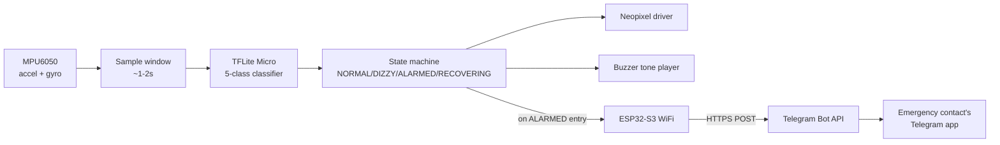
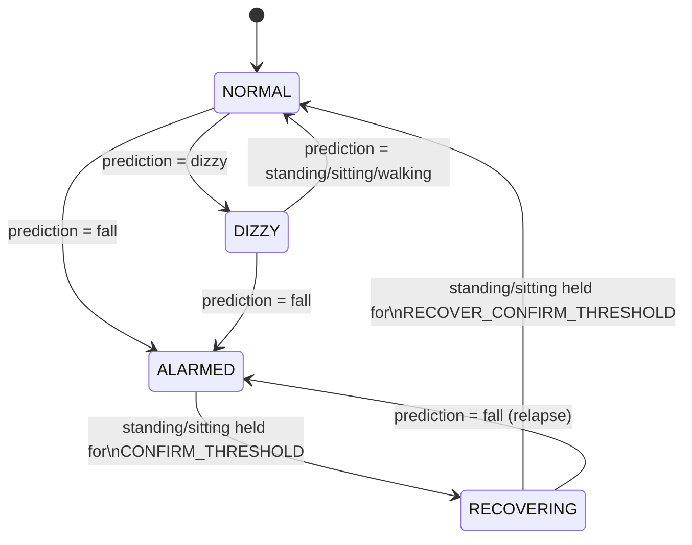

# PRD: Fall Detection & Alert System

2026-09-17 · @u_Gd73xkkFmo9snIgr0fdFzg

An ESP32-S3 wearable/room device classifies body state (standing, sitting, walking, dizzy, fall) from MPU6050 data on-device, drives Neopixel/buzzer feedback per state, and sends a Telegram alert to an emergency contact when a fall is confirmed.

## Goals & Scope

**Problem.** A person living or working alone has no automatic way to signal a fall. Manual alerting (pressing a button, calling out) fails exactly when someone is unconscious or too disoriented to act.

**Goals**

- Classify body state in real time from wrist/waist-mounted IMU data: standing, sitting, walking, dizzy, fall.
- Give silent, glanceable feedback (Neopixel color) for every state, so the device is not alarming during normal activity.
- Escalate audibly only for concerning states (dizzy, fall), with a distinct tone per state so a caregiver can tell severity from sound alone.
- On a confirmed fall, notify a remote emergency contact over Telegram without requiring the fallen person to act.
- Require a sustained, confirmed return to normal activity before silencing an alarm, to avoid false-clears from momentary misreads.

**Non-goals (v1)**

- No health diagnosis or vital-sign monitoring — the device infers activity state from motion only.
- No GPS/location in the alert (device is assumed stationary within one home/room; add location as a v2 item if the wearable becomes mobile).
- No two-way voice or video in the alert — the Telegram message is informational, not a call.

**Success criteria**

- 5-class classifier reaches acceptable accuracy on held-out data (target ≥90%, tune per Edge Impulse validation).
- End-to-end latency from fall event to Telegram message received under \~5 seconds on a stable WiFi connection.
- Zero missed real falls during test scenarios take priority over false-positive rate — tune the confirm thresholds accordingly.

## Devices & Bill of Materials

| Component | Role in this project |
| --- | --- |
| ESP32-S3 | Runs the TFLite Micro classifier, state machine, and WiFi/Telegram calls |
| MPU6050 (gyroscope + accelerometer) | Primary sensor — feeds the windowed IMU data the classifier reads |
| Neopixel LEDs (onboard) | Silent per-state color feedback |
| Buzzer | Distinct tone per concerning state (dizzy, fall, recovering) |
| WiFi (onboard ESP32-S3 radio) | Sends the Telegram alert on confirmed fall |

**Not used in this project:** camera, DHT11, IR sensor, ultrasonic sensor, fan/relay, servo motor — reserved for the Focus Mode Tracking PRD.

## System Architecture

This project is almost entirely on-device: the only "bridge" beyond the ESP32-S3 is the outbound call to Telegram's cloud API, so there is no local dashboard or laptop process in the loop.



*Reading it: sensor → on-device inference → state machine → local actuators (always) and a one-shot cloud call (only on the ALARMED transition). Everything left of the WiFi node runs entirely on the ESP32-S3 with no network dependency, so the local alarm still works if WiFi is down — only the remote notification is lost.*

## State Machine



| State | Neopixel | Buzzer |
| --- | --- | --- |
| Standing / Sitting / Walking (within NORMAL) | Blue / Cyan / Green | Silent |
| Dizzy | Amber | Intermittent warning tone |
| Alarmed (fall) | Red, pulsing | Continuous paramedic siren |
| Recovering | Amber → Green fade | Short descending recovery chirp |

Recovery out of ALARMED and out of RECOVERING each require a **sustained** run of normal readings (`CONFIRM_THRESHOLD`, `RECOVER_CONFIRM_THRESHOLD`), not a single frame — a single "standing" misread should never silence a real emergency early. A relapse (fall reading during RECOVERING) jumps straight back to ALARMED rather than starting a fresh detection cycle.

## Pseudocode

```
state = NORMAL   // NORMAL, DIZZY, ALARMED, RECOVERING
confirm_counter = 0
alert_sent = false

loop every N ms:
    window = collect_imu_samples(window_size)
    prediction = tinyml_classify(window)  // standing, sitting, walking, dizzy, fall
    update_neopixel(prediction, state)

    if state == NORMAL:
        if prediction == FALL:
            state = ALARMED
            start_siren()
            alert_sent = false
        elif prediction == DIZZY:
            state = DIZZY
            start_warning_tone()

    elif state == DIZZY:
        warning_tone_tick()
        if prediction == FALL:
            stop_warning_tone()
            state = ALARMED
            start_siren()
            alert_sent = false
        elif prediction in [STANDING, SITTING, WALKING]:
            stop_warning_tone()
            state = NORMAL

    elif state == ALARMED:
        siren_tick()
        if not alert_sent and wifi_connected():
            send_telegram_message(EMERGENCY_CHAT_ID,
                "Fall detected at " + get_timestamp() + ". Siren active.")
            alert_sent = true   // fire once per event, never resend while ALARMED

        if prediction in [STANDING, SITTING]:
            confirm_counter += 1
            if confirm_counter >= CONFIRM_THRESHOLD:
                stop_siren()
                start_recovery_tone()
                state = RECOVERING
                confirm_counter = 0
        else:
            confirm_counter = 0   // any wobble resets — must be a clean, sustained recovery

    elif state == RECOVERING:
        recovery_tone_tick()
        if prediction in [STANDING, SITTING]:
            confirm_counter += 1
            if confirm_counter >= RECOVER_CONFIRM_THRESHOLD:
                stop_recovery_tone()
                state = NORMAL
                if wifi_connected():
                    send_telegram_message(EMERGENCY_CHAT_ID, "Resolved: back to normal activity.")
        elif prediction == FALL:
            stop_recovery_tone()
            start_siren()
            state = ALARMED
            confirm_counter = 0
            alert_sent = false   // relapse — send a fresh alert
        else:
            confirm_counter = 0
```

Implementation notes:

- `siren_tick()`, `warning_tone_tick()`, `recovery_tone_tick()` must be non-blocking (driven by `millis()`, not `delay()`), or the IMU sampling loop stalls while a tone plays.
- The Telegram call should never block the main loop — treat WiFi failure as "local alarm still fires, remote notification is skipped this cycle."

## Data & Training Plan

**Tooling:** Edge Impulse, using its Data Forwarder to stream MPU6050 samples over serial straight into data acquisition — avoids hand-logging CSVs.

**Pipeline:** Spectral Analysis + Classification impulse (Edge Impulse's standard template for accelerometer/gyro continuous motion recognition), deployed as a C++/Arduino library into the ESP32 sketch.

**Per-class collection notes:**

- Standing, sitting, walking — straightforward to capture directly, several minutes each, varied pace/posture.
- Dizzy/unsteady — hardest class; simulate by walking with deliberately irregular gait (staggering, uneven steps) since real dizziness isn't reproducible on demand. Label carefully and expect this class to need the most iteration.
- Fall — simulate onto a soft surface (mattress/mat) from multiple angles (forward, backward, sideways) to cover different acceleration/orientation signatures.

**Split:** standard train/validation/test split per class, with class balance checked before training since fall/dizzy samples will naturally be fewer than standing/walking.
