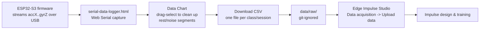

# tools/

## serial-data-logger.html

A self-contained Web Serial page (Chrome/Edge only) for capturing MPU6050 CSV data during Phase 4 data collection. No build step, no server — just open the file directly in a Chromium browser.

### Why this exists

Two Edge Impulse ingestion paths turned out to be dead ends for this project's setup:

1. `edge-impulse-cli` (for the classic Data Forwarder) failed to install — one dependency needs native compilation via Visual Studio Build Tools, which weren't installed.
2. Edge Impulse Studio's browser-based "Connect a new device" WebSerial flow requires the device firmware to speak Edge Impulse's AT-command protocol — a different thing entirely from the plain CSV our sketch streams.

So data is captured locally with this tool instead, cleaned up, and the resulting CSVs are imported into Edge Impulse via Studio's **Data acquisition → Upload data** wizard.

### How to use it

1. Open `serial-data-logger.html` directly in Chrome or Edge.
2. Flash the board with the current data-forwarder sketch (`src/main.cpp`), which streams `accX,accY,accZ,gyrX,gyrY,gyrZ` at ~50Hz.
3. Click **Connect Serial**, pick the board's port, confirm baud rate matches the sketch (115200 by default — hover the `?` next to the field if unsure what this means).
4. Fields default to 6 (`ax, ay, az, gx, gy, gz`) matching the sketch — rename them if your sketch's columns differ.
5. Set a **File Name** for the session (e.g. `standing_01`).
6. Click **Start Logging**, perform the activity, click **Stop Logging**.
7. Use the **Data Chart** to spot and clean up bad segments: click a legend chip to isolate a field, then click-and-drag over a range you want gone (e.g. the calm/rest periods between repeated fall attempts) — this selects those rows, which you then remove with **Delete Selected**.
8. Click **Download CSV** and save it into `data/raw/` (git-ignored — see `data/README.md`).
9. Repeat per class/session, then import the CSVs into Edge Impulse.

### Data collection pipeline

One continuous recording = one class label (Edge Impulse's CSV upload labels the whole file), so classes are never mixed within a single CSV. See `docs/TASKS.md` (Phase 4) for the per-class collection notes, including how "fall" is captured as repeated attempts in one session and then split via the chart's cleanup step.
