# tools/

## mpu6050-data-forwarder.cpp

The firmware sketch used to collect all Phase 4 training data — streams `accX,accY,accZ,gyrX,gyrY,gyrZ` over serial at ~50Hz for `serial-data-logger.html` to capture. Archived here once Phase 5 replaced `src/main.cpp` with the real firmware. PlatformIO only compiles `src/`, so to reuse this (e.g. to collect more training data later), copy it into `src/main.cpp`, rebuild, and reflash.

## serial-data-logger.html

A self-contained Web Serial page (Chrome/Edge only) for capturing MPU6050 CSV data during Phase 4 data collection. No build step, no server — just open the file directly in a Chromium browser.

### Why this exists

Two Edge Impulse ingestion paths turned out to be dead ends for this project's setup:

1. `edge-impulse-cli` (for the classic Data Forwarder) failed to install — one dependency needs native compilation via Visual Studio Build Tools, which weren't installed.
2. Edge Impulse Studio's browser-based "Connect a new device" WebSerial flow requires the device firmware to speak Edge Impulse's AT-command protocol — a different thing entirely from the plain CSV our sketch streams.

So data is captured locally with this tool instead, cleaned up, and exported as plain CSVs. (Edge Impulse was later dropped entirely — see `tinyml-trainer.html` below — but this tool's job, turning a live serial stream into a clean labeled CSV, stayed the same either way.)

### How to use it

1. Open `serial-data-logger.html` directly in Chrome or Edge.
2. Flash the board with the current data-forwarder sketch (`src/main.cpp`), which streams `accX,accY,accZ,gyrX,gyrY,gyrZ` at ~50Hz.
3. Click **Connect Serial**, pick the board's port, confirm baud rate matches the sketch (115200 by default — hover the `?` next to the field if unsure what this means).
4. Fields default to 6 (`ax, ay, az, gx, gy, gz`) matching the sketch — rename them if your sketch's columns differ.
5. Set a **File Name** for the session (e.g. `standing_01`).
6. Click **Start Logging**, perform the activity, click **Stop Logging**.
7. Use the **Data Chart** to spot and clean up bad segments: click a legend chip to isolate a field, then click-and-drag over a range you want gone (e.g. the calm/rest periods between repeated fall attempts) — this selects those rows, which you then remove with **Delete Selected**.
8. Click **Download CSV** and save it into `data/raw/` (git-ignored — see `data/README.md`).
9. Repeat per class/session.
10. To revisit an already-saved recording for a second cleanup pass, use **Load CSV** to reopen it in the table/chart.

## tinyml-trainer.html

A self-contained TensorFlow.js page (any modern browser, internet access needed once for the CDN scripts) that trains a small dense-network classifier on the CSVs above, entirely client-side, and exports a plain C header ready to drop into firmware.

### Why this exists

Edge Impulse was dropped as the training platform too, not just the data-connection method. A 5-class classifier on raw windowed IMU samples doesn't need Edge Impulse's DSP/Spectral Analysis blocks, and training locally keeps the whole pipeline reproducible without an external account. The exported model is a set of raw float weight/bias arrays for a `dense(16) → dense(8) → dense(numClasses)` network — no TFLite Micro runtime needed, just a hand-rolled forward pass in firmware (Phase 5).

### How to use it

1. Open `tinyml-trainer.html` directly in a browser.
2. For each class, click **+ Add Class**, name it, and upload its CSV from `data/raw/` (the header row is auto-detected and skipped).
3. All classes must share the same number of feature columns — the tool validates this and shows an error otherwise.
4. Set **Window size** — this is the number of consecutive samples flattened into one training example. **This matters a lot**: too short a window can't capture what an event like a fall actually looks like. At 50Hz, a window of 75 samples ≈ 1.5 seconds, matching the PRD's suggested window range. See `docs/TASKS.md` (Phase 4) for the full tuning story — window size 5 (100ms) performed far worse than 75.
5. Set **Epochs**, **Learning rate**, and a **Model name**, then click **Train Model**. Training runs entirely in your browser; the log streams live loss/accuracy per epoch.
6. Check the **Confusion Matrix** that appears after training — it's computed on a held-out validation split and specifically flags in red if any "fall" samples were misclassified, since overall accuracy can look good while still missing falls (the one thing this project can't afford, per the PRD).
7. Export: **C Header (.h)** is the one that matters for firmware — save it as `include/fall_detection_model_data.h`. The other exports (TF.js model, labels.txt, `.tflite` Python converter script) are there if you want to keep training or convert to TFLite Micro instead later.

### A real bug this tool taught us

Early training runs showed validation accuracy stuck around 0.3–0.5 and bouncing around while training accuracy climbed normally to ~0.84 — it looked like classic overfitting, but the actual cause was more specific: the windowed dataset was built one class at a time (all "fall" windows, then all "sit" windows, etc.), and TensorFlow.js's `validationSplit` carves its slice off the *end* of that array *before* any shuffling happens each epoch. The validation set ended up being almost entirely just the last class or two — not a representative sample. The fix was shuffling the windowed samples across all classes before calling `model.fit()`. Worth knowing if you extend this tool or write something similar: `validationSplit` is not a substitute for shuffling your own data first.

### Data collection & training pipeline

```mermaid
flowchart LR
    FW[ESP32-S3 firmware<br/>streams accX..gyrZ over USB] --> LOG[serial-data-logger.html<br/>Web Serial capture]
    LOG --> CHART[Data Chart<br/>drag-select to clean up<br/>rest/noise segments]
    CHART --> CSV[Download CSV<br/>one file per class/session]
    CSV --> RAW[data/raw/<br/>git-ignored]
    RAW --> TRAIN[tinyml-trainer.html<br/>windowing + dense NN training]
    TRAIN --> CONF[Confusion matrix check<br/>especially fall misses]
    CONF --> HEADER[C header export]
    HEADER --> INCLUDE[include/fall_detection_model_data.h]
    INCLUDE --> FW2[Phase 5 firmware<br/>hand-rolled inference]
```

One continuous recording = one class label, so classes are never mixed within a single CSV. See `docs/TASKS.md` (Phase 4) for the per-class collection notes, including how "fall" is captured as repeated attempts in one session and then cleaned up via the chart's drag-select, and the full window-size tuning results.
